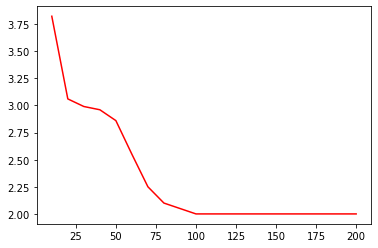
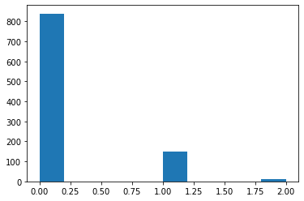
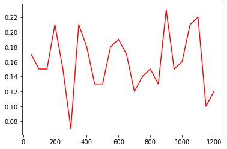
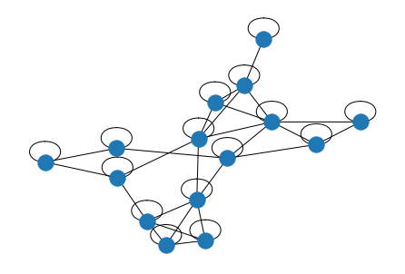

# Probabilistic Graph Clustering

Graph clustering worked the long way: start from a probabilistic model of how a graph
was generated, derive the estimator by hand, implement it in plain NumPy, then check the
implementation against simulation.

Four families of methods are built here from their definitions rather than called from a
library: an affiliation (BigCLAM-style) model with overlapping communities, a stochastic
block model with a maximum-likelihood label search, spectral clustering via the graph
Laplacian, and a random-walk (Walktrap-style) agglomerative method. Alongside them sits a
set of Erdős-Rényi simulations that check closed-form predictions for edge counts, degree
distributions, triangles, shortest paths and diameter against measured values.

Everything is accompanied by the derivations it came from. The 45-page write-up
(`ProjectAnswer.pdf`, and its LaTeX sources) carries the algebra for every implementation
in this repository, so each function can be traced back to the probability it encodes.

## The problem

Clustering a graph means recovering hidden group structure from edges alone. The setting
we used is a video-on-demand recommender: users are vertices, an edge means two users have
similar taste, and the goal is to find groups of users so the service can recommend the
same films to everyone in a group.

That framing raises a question a clustering library does not answer: if you assume a
specific random process produced the graph, what is the right way to invert it? Each
section below picks a generative model, derives its likelihood, and turns that likelihood
into an algorithm.

## What is implemented

### Affiliation model with overlapping communities

Each person `u` gets a nonnegative membership row `F[u]` over `C` communities, and two
people are connected with probability

```
P_uv = 1 - exp(-sum_i F[u][i] * F[v][i])
```

so sharing more communities raises the edge probability. The log-likelihood of an observed
adjacency matrix under this model collapses to

```
l(F) = sum_{u,v} log( 3*A[u][v] + (1 - 2*A[u][v]) * exp(-sum_i F[u][i]*F[v][i]) )
```

`All Codes/1.py` holds that log-likelihood, its gradient with respect to a single row of
`F`, and a projected gradient ascent loop that clamps `F` back to nonnegative values after
every step. The full derivation of both the likelihood and the gradient is in the write-up.
See [Caveats](#caveats) before running this one.

### Stochastic block model and maximum-likelihood label search

`All Codes/2.py` samples adjacency matrices from an SBM: `k` blocks, edge probability `p`
inside a block and `q` across blocks, with labels drawn so the blocks stay balanced.
`6.py` scores a candidate labelling by its negative log-likelihood, and `7.py` searches for
the best labelling by repeatedly finding the single pair swap that reduces the score most,
applying it, and repeating.

The interesting part is the error metric. A labelling is only defined up to a permutation
of the label names, so plain Hamming distance to the ground truth is meaningless. `5.py`
enumerates all `k!` relabellings of a candidate vector and takes the minimum Hamming
distance over the whole equivalence class, which makes the score permutation invariant.

`8.py` runs the greedy search from ten random starts and `9.py` reports which starts landed
exactly on the true labelling.

### Spectral clustering

`13.py` builds the unnormalized Laplacian `L = D - A`, takes the eigenvector belonging to
the second smallest eigenvalue (the Fiedler vector), and splits the vertices by the sign of
its entries. It does this twice per trial, once on the sampled adjacency matrix `A` and
once on the expectation matrix `W`, so the error introduced by sampling noise can be read
off directly, for `n` from 25 up to 800.

`15.py` extends the idea past two clusters: it stacks the first `k` nontrivial eigenvectors
into an embedding, one row per vertex, and runs k-means on that embedding. It is applied to
Zachary's karate club for `k = 2, 3, 4` and draws the graph coloured by the result.

`16.py` answers the follow-up question of how to pick `k`. It computes the conductance of
each cluster, the fraction of a cluster's incident edges that leave it, averages over
clusters, and plots that average against `k` from 2 to 10. The lowest point is the cut that
the graph actually supports.

### Random-walk clustering

`28.py` and `29.py` implement a Walktrap-style method. A `t`-step random walk has transition
matrix `P^t = (D^-1 A)^t`, and the distance between two vertices is the degree-weighted
Euclidean distance between their rows of `P^t`:

```
R(i,j) = sqrt( sum_k (P[i][k] - P[j][k])^2 / d[k] )
```

Clusters start as singletons, the closest pair merges at each step, and the loop stops when
twice the number of edges leaving the clusters drops to or below the number of edges inside
them. The two scripts differ only in walk length, `t = 2` and `t = 5`, which is enough to
see how the walk horizon changes the merge order on the karate club.

### k-means on tabular data

`14.py` steps outside graphs: it clusters California housing districts into three groups by
median income and plots them over latitude and longitude, as a check that the same
objective behaves the way you expect on ordinary feature vectors.

### Erdős-Rényi simulations

`17.py` through `27.py` measure properties of `G(n, p)` and compare them against closed
forms derived in the write-up: expected edge count, degree distribution in the sparse
regime, closed versus open triples, triangles through a fixed vertex, mean shortest path
length, diameter, and how the triangle count scales when `p` is held fixed, set to `60/n^2`,
or set to `1/n`.

## Results

Every number and figure below was produced by the scripts in this repository and is
recorded in the committed notebook outputs.

### Recovering block labels

With `n = 15`, `k = 3`, `p = 0.6`, `q = 0.1`, the true labelling scored a negative
log-likelihood of **95.419**. Out of ten random restarts of the greedy swap search, two
reached exactly that score, and both were checked to be at permutation-invariant Hamming
distance **0** from the ground truth. A single run starting from the balanced initial
labelling drove the distance down through **5, 3, 2, 0** over four swaps.

### Random graph measurements against theory

| Script | Setup | Measured | Prediction in the write-up |
| --- | --- | --- | --- |
| `17.py` | `n = 1000`, `p = 0.0034`, 10 runs | 1677.1 edges | `C(n,2) * p` = 1698.3 |
| `18.py` | `n = 1000`, `p = 0.00016`, 10 runs | 151.3 vertices with at least one edge | `n * (1 - (1-p)^(n-1))` ≈ 147 |
| `19.py` | `n = 3000`, `p = 0.01`, 5 runs | 4503.8 closed triples, 447691.2 open triples | `C(n,3) * p^3` and `C(n,3) * p^2 * (1-p)` |
| `20.py` | `n = 1000`, `p = 0.003` | 0.01 triangles per vertex | `C(n-1,2) * p^3` |
| `21.py` | `n = 1000`, `p = 0.033` | mean shortest path 2.2955 | connectivity needs `p` above `ln(n)/n` |
| `22.py` | `n = 50`, `p = 0.34`, 100 runs | mean diameter 2.82 | diameter tends to 2 for large `n` |
| `24.py` | `n = 100`, `p = 0.34`, 100 runs | 6323.84 triangles | `C(n,3) * p^3` |

### Figures

Mean diameter of `G(n, 0.34)` as `n` grows from 10 to 200. It settles on exactly 2 from
around `n = 100` and stays there, which is what the write-up predicts: for large `n` almost
every pair of vertices has a common neighbour, so the diameter is 2 regardless of `p`.



Degree histogram for `n = 1000`, `p = 0.00016`, where the mean degree is about 0.16. Around
835 vertices are isolated, about 150 have degree 1, and a dozen have degree 2.



Triangle count when `p = 1/n`, for `n` from 50 to 1200. The count does not grow with `n`;
it stays in a band roughly between 0.08 and 0.23, scattered around `1/6`, since
`C(n,3) * (1/n)^3` tends to `1/6`.



A 15-vertex sample from the stochastic block model with `k = 3`, `p = 0.6`, `q = 0.1`,
drawn by NetworkX. The self-loops are there because the sampler sets the diagonal of `A`
to 1.



## Repository layout

```
All Codes/            29 standalone Python scripts, numbered to match the write-up
Jupyter Notebooks/    3 notebooks with the derivations and code side by side,
                      outputs and figures included
Project Latex/        LaTeX sources for the write-up, one file per question, plus
                      the XB Niloofar fonts it needs
ProjectAnswer.pdf     the compiled 45-page write-up: derivations, code, results
figures/              figures extracted from the notebook outputs, used above
```

The notebooks and the scripts overlap on purpose. The notebooks interleave each derivation
with the code that tests it and keep the rendered figures inline; `All Codes/` holds the
same code as flat files so any single experiment can be run on its own.

Notebook `2` covers the affiliation model, notebook `3` covers the stochastic block model
and the label search, and notebook `5` covers the Erdős-Rényi simulations. The spectral and
random-walk sections exist only as scripts.

## Running it

```
python -m venv .venv
source .venv/bin/activate          # Windows: .venv\Scripts\activate
pip install numpy scipy networkx matplotlib scikit-learn pandas
```

Then run any experiment directly:

```
python "All Codes/13.py"           # spectral clustering error vs n, 25 to 800
python "All Codes/16.py"           # conductance curve on the karate club
python "All Codes/29.py"           # random-walk clustering, 5-step walks
```

`14.py` downloads the California housing dataset through scikit-learn on first run, so it
needs network access. Scripts `4.py` through `9.py` continue a session rather than starting
one: they use `n`, `k`, `Q`, `create_A` and other names defined by `2.py` and earlier cells,
so run them from `Jupyter Notebooks/3.ipynb` instead of as standalone files.

To rebuild the write-up, compile `Project Latex/writeup.tex` with XeLaTeX. It uses
`xepersian` and the XB Niloofar font family shipped alongside it.

## Script index

| File | What it does |
| --- | --- |
| `1.py` | Affiliation model: log-likelihood, gradient, projected gradient ascent |
| `2.py` | Draw 10 adjacency matrices from the stochastic block model |
| `3.py` | Draw one SBM sample as a NetworkX graph |
| `4.py` | Hamming distance between two label vectors |
| `5.py` | Hamming distance minimised over all `k!` label permutations |
| `6.py` | Negative log-likelihood of a labelling under the SBM |
| `7.py` | Greedy pairwise-swap search for the maximum-likelihood labelling |
| `8.py` | Ten random restarts of the greedy search |
| `9.py` | Which restarts recovered the true labelling exactly |
| `10.py`, `11.py` | Short notes on the restart results |
| `12.py` | Fiedler vector of the Laplacian on a two-community graph |
| `13.py` | Spectral two-way clustering on `A` and on `W`, error counts for `n` = 25 to 800 |
| `14.py` | k-means on California housing median income, plotted geographically |
| `15.py` | Spectral embedding of the karate club, k-means for `k` = 2 to 4 |
| `16.py` | Mean conductance against number of clusters, `k` = 2 to 10 |
| `17.py` | Mean edge count of `G(n, p)` |
| `18.py` | Degree distribution of a sparse `G(n, p)` |
| `19.py` | Closed against open triples |
| `20.py` | Mean triangles through a vertex |
| `21.py` | Mean shortest path length |
| `22.py` | Mean diameter |
| `23.py` | Mean diameter against `n` at fixed `p` |
| `24.py` | Mean triangle count at fixed `n` and `p` |
| `25.py` | Triangle count with `p = 60/n^2` |
| `26.py` | Triangle count against `n` at fixed `p` |
| `27.py` | Triangle count with `p = 1/n` |
| `28.py` | Random-walk agglomerative clustering of the karate club, `t = 2` |
| `29.py` | The same with `t = 5` |

## Implementation notes

**Permutation-invariant scoring.** Cluster labels carry no meaning, so comparing a
recovered labelling to the truth requires minimising over relabellings. `5.py` does this by
brute force over all `k!` permutations, which is fine at `k = 3` and is the honest thing to
do rather than assuming label alignment.

**Sampled matrix against expectation matrix.** `13.py` runs the same spectral procedure on
the realised adjacency matrix `A` and on the matrix `W` of edge probabilities that generated
it. `W` is the noise-free case, so the gap between the two error counts isolates how much
damage sampling noise does at each `n`.

**Conductance as a model-selection signal.** Rather than fixing the number of clusters,
`16.py` sweeps `k` and plots the mean fraction of edges that leave a cluster. That turns
"how many communities are there" into something measurable from the graph itself.

**Connectivity threshold.** `21.py` measures mean shortest path length, which is only
defined on a connected graph. At `n = 1000` the stated `p = 0.0033` sits below the
connectivity threshold `ln(n)/n` ≈ 0.0069, so almost every sample is disconnected and the
measurement is undefined. The script uses `p = 0.033` instead.

**Stopping rule for merging.** The random-walk method in `28.py` and `29.py` stops merging
when `2 * edges_out <= edges_in`, a ratio test on the current partition rather than a fixed
target cluster count.

## Caveats

These are worth knowing before reading the code as a reference implementation.

- **`1.py` was derived but never run.** It mixes `numpy` and `np`, references an undefined
  `u`, and has a `summP` / `summp` typo in the gradient. Read it as the derivation expressed
  in code, not as a working trainer. The mathematics it encodes is checked in the write-up.
- **`12.py` has a sampling bug.** Its community assignment loop rebinds the loop variable
  instead of writing into the array, so every vertex ends up in the same community, and the
  adjacency matrix is filled on one triangle only. `13.py` is the corrected version of the
  same experiment and is the one to read.
- **`18.py` disagrees with its notebook version.** The script counts vertices with degree
  below the mean; the notebook counts vertices at or above it. The notebook version is the
  one whose output (151.3) matches the derived value of about 147.
- **The write-up is in Persian.** The mathematics, the code listings and the plots are
  readable regardless, but the prose is not.

## Authors

Iman Mohammadi ([@Imanm02](https://github.com/Imanm02)),
Ali Shahali ([@alishahali1382](https://github.com/alishahali1382)),
Parsa Massah ([@mparsam](https://github.com/mparsam)).

Released under the [MIT License](LICENSE).

---

### Background

We wrote this in early 2023 as a three-person term project for an engineering probability
and statistics course at Sharif University of Technology, which is why the write-up and the
LaTeX sources are in Persian and why the material is organised as derivation followed by
simulation. The code and the derivations stand on their own.
